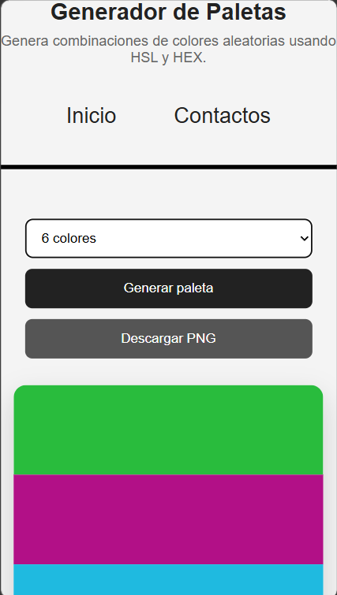
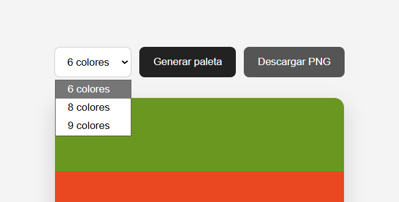

### 🎨 Generador de Paletas de Colores

## Índice 
- [Prompts y usos de la IA](docs/prompts.md) 

Una aplicación web sencilla para generar paletas de colores aleatorias de 6, 8 o 9 colores, utilizando los formatos HSL y HEX.

 Características
- Generación de paletas de 6, 8 o 9 colores.
- Paleta mostrada como una tira vertical continua.
- Generación de colores utilizando HSL.
- Conversión de HSL a HEX para representar el mismo color en ambos formatos.
- Visualización del código HEX al pasar el mouse sobre un color.
- Copiado de códigos HEX y HSL al portapapeles.
- Aviso visual al copiar un código.
- Animación al generar una nueva paleta.
- Diseño adaptable para escritorio y dispositivos móviles.
- Descarga de la paleta como imagen PNG.
- La imagen descargada contiene únicamente la tira de colores.

###  Cómo utilizar el proyecto

1. Seleccionar la cantidad de colores

Seleccioná una de las opciones disponibles:

6 colores
8 colores
9 colores
2. Generar la paleta

Después de seleccionar la cantidad de colores, presioná el botón "Generar paleta".

Cambiar la cantidad de colores no genera automáticamente una nueva paleta. Es necesario presionar el botón.

3. Copiar un color

Al pasar el mouse sobre un color de la paleta se muestra su código HEX.

Al hacer clic sobre el color, el código se copia automáticamente.

También es posible copiar los valores HSL y HEX desde la información que aparece debajo de la paleta.

4. Descargar la paleta

Presionando "Descargar PNG" se genera una imagen que contiene únicamente los colores de la paleta.

El tamaño de la imagen se adapta automáticamente según la cantidad de colores seleccionados.

## 📸 Capturas

### 💻 Versión de escritorio

- Entrando desde este link ya podes usar la aplicacion:()

- Simplemente selecciona a la cantidad de colores y generala

### 📱 Versión móvil

## Estructura

  ProyectoM1_VerdunJuan
- │
- ├── index.html
- ├── app.js
- ├── styles.css
- ├── README.md
- │
- └── docs/
    - ├── prompts.md
    - │
    - └── img/
        - ├── image1.png
        - ├── image2.png
        - ├── image3.png
        - ├── image4.png
        - ├── image5.png
        - ├── image6.png
        - ├── image7.png
        - ├── image8.png
        - ├── image9.png
        - ├── image10.png
        - ├── image11.png
        - └── image12.png

Tenia planeado implementar funciones como bloquear colores y guardar colores pero eso era demasiado complicado y no entendía el codigo para guardarlos de manera local
en un futuro planeo implementar esas funciones

## Licencia 
MIT