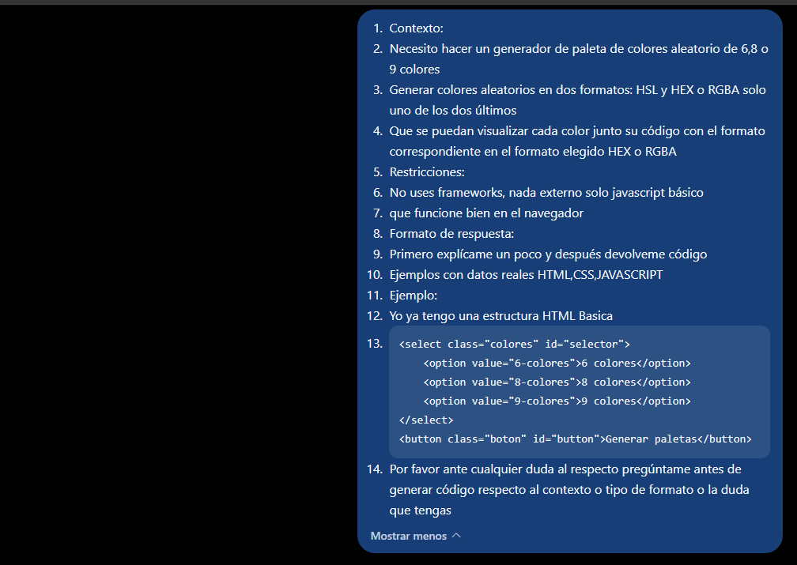
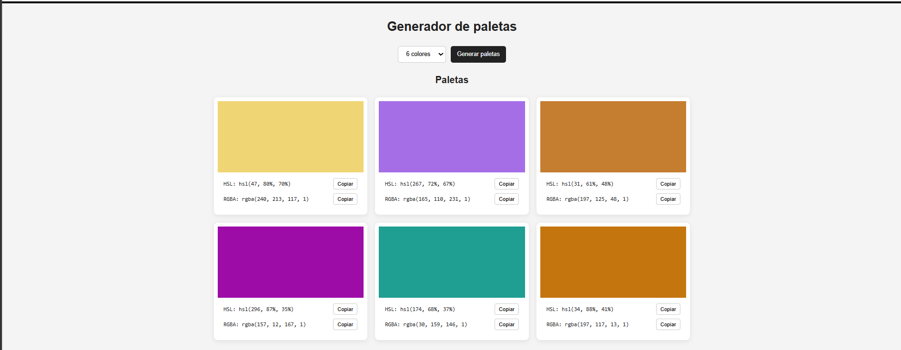
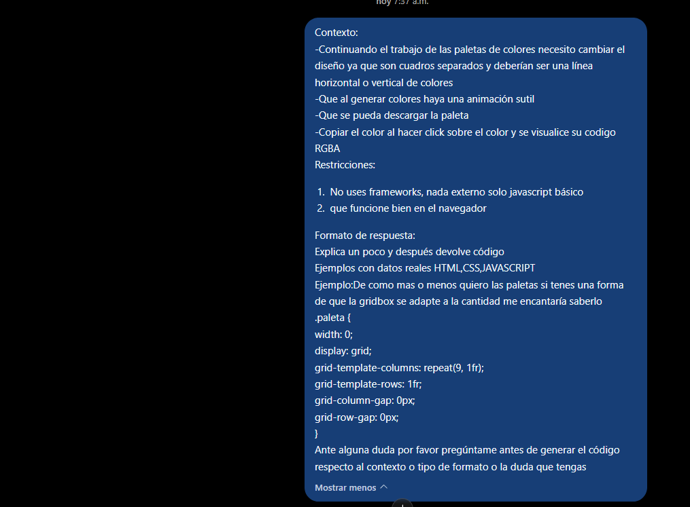
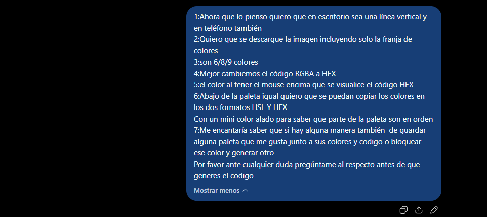
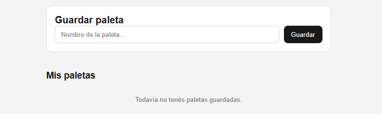
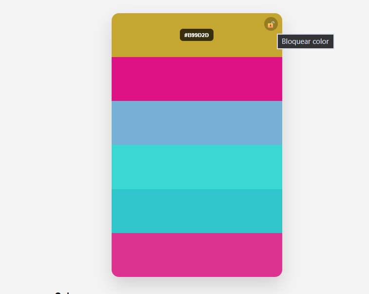
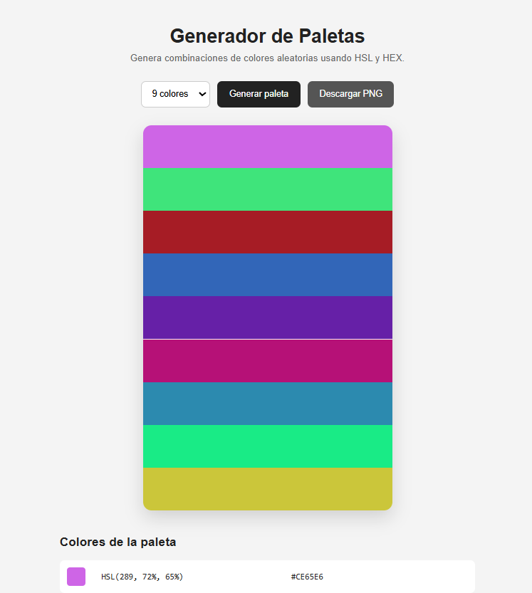
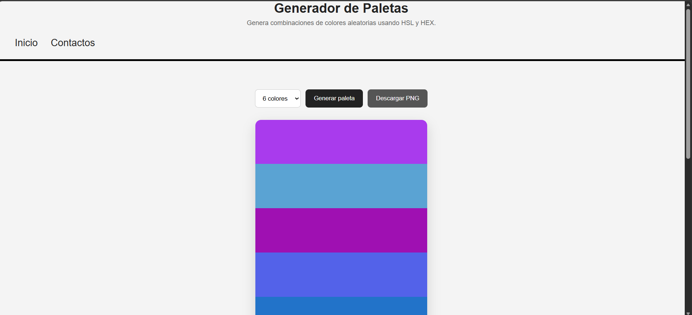
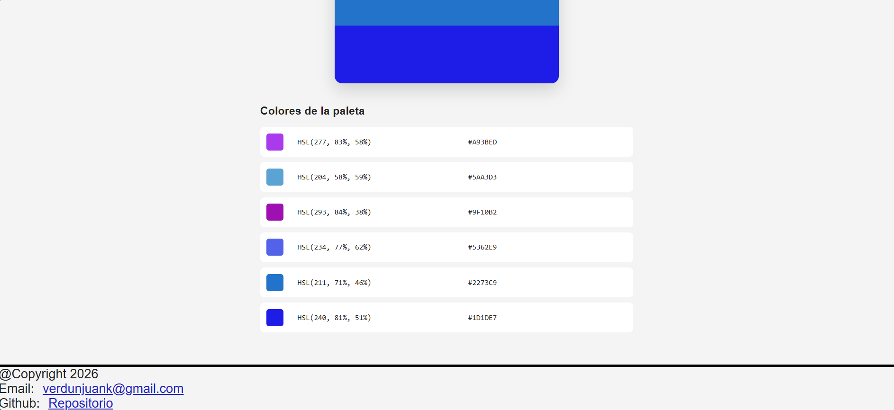

- [Volver](../README.md) 

## La IA y flujo de la APP
- Durante el desarrollo de la aplicacion use Prompts bastantes precisos con ejemplos para que la IA Comprendiera lo que queria hacer en JAVASCRIPT Y CSS y que me ayudara a comprender mejor la entrada de los valores por el usuario a la hora de seleccionar colores en el HTML y que pasen al JAVASCRIPT

## mis prompts

- mi primer resultado fue exitoso al parecer Le pedi ala IA que me explicara paso a paso como funciona y por que para comprender mejor JAVASCRIPT y los inputs del usuario 
Pero el css lo tuve que modificar ya que arrojo colores separadas no era lo que queria en CSS así que de igual forma

- En el prompt 2 habia sido mas especifico con lo que queria y habia modificado el DOM para poder ver el estilo correcto de paletas de colores y usar lo que modifique para hacer el siguiente prompt

- pero debido a la IA le quedaban dudas sin resolver 
le di mas detalles y aclarando sus dudas punto por punto

- Debido haberle pedido que agregue bloqueo de colores y guardado local la lógica con la que estaba trabajando cambio demasiado había modificado por completo la lógica y me lanzo un código java demasiado extenso mas de 1000 Líneas de código que no entendía 

-El resultado se ve bien y "funcional" pero no entendía nada de lo que pasaba así que lo descarte de inmediato 

-en este ultimo prompt use todo lo que habia aprendido y hacerlo lo mas simple solo se agrego la funcion de descargar la paleta y ver los colores HSL Y HEX con una ayuda visual de cual es el color en el CSS tome mucha inspiracion de [COLOR HUNT](https://colorhunt.co/)

Resultado
-Finalmente agregué:
-Descarga de la paleta como imagen.
-Visualización de los valores HSL y HEX.
-Copiado de los códigos de color.
-Una ayuda visual para identificar cada color.
-Una paleta vertical continua.
-Adaptación para dispositivos móviles.

## Conclusión

Fue una herramienta de apoyo muy útil como herramienta de aprendizaje y apoyo mientras se hacen los Prompts y se analizan los resultados modificando el código y además ayudándome a comprender mejor la relación entre HTML, CSS y JavaScript especialmente cómo una simple selección realizada por el usuario puede ser recibida en JavaScript y utilizada posteriormente para modificar el DOM y generar contenido dinámicamente.

